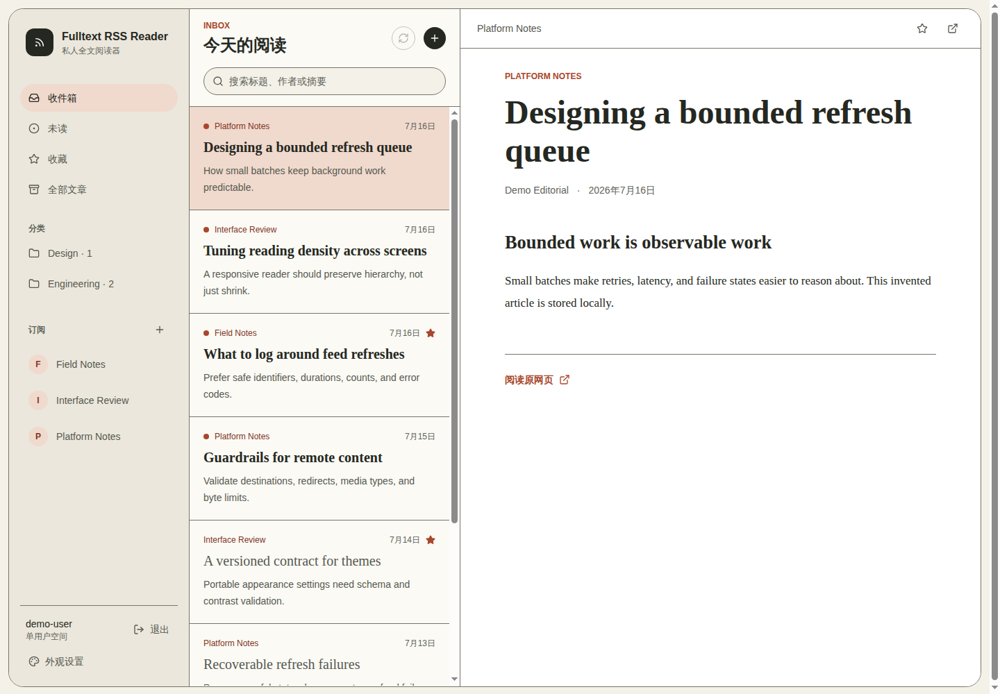
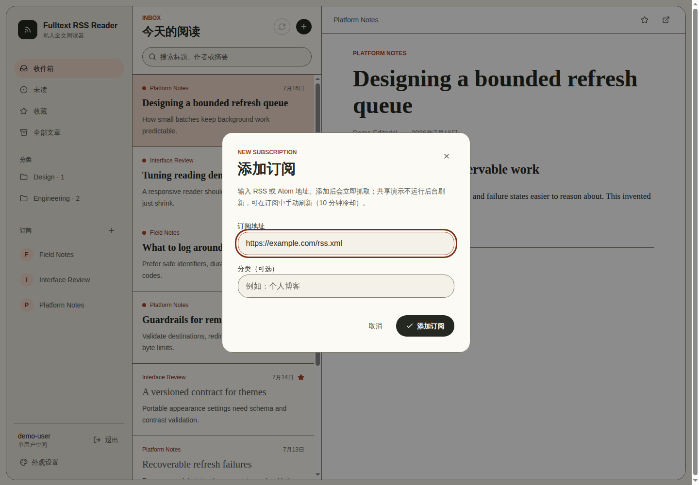
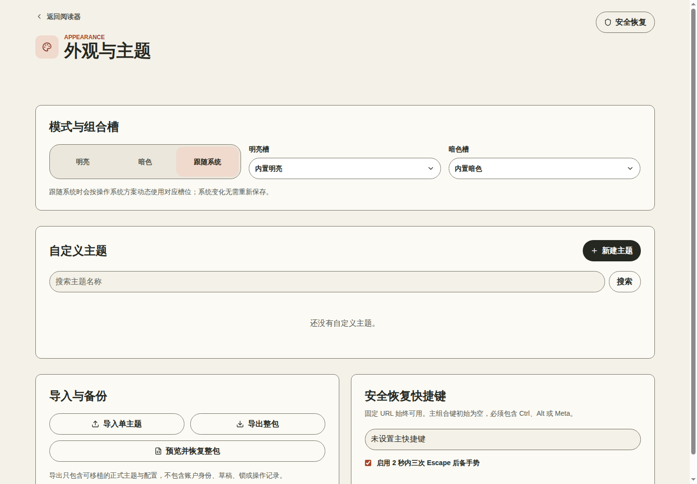

# Fulltext RSS Reader

[English](README.md)

一个面向单用户的 RSS/Atom 全文阅读器，提供全文提取、后台刷新、受保护的远程内容抓取，以及可版本化的外观与主题设置。

[在线演示](https://rss-demo.713007.xyz/) | [架构说明](docs/architecture.md) | [安全策略](SECURITY.md)




以下截图来自可定期重置的公开在线演示，分别展示登录后的阅读器、新增 RSS/Atom 订阅，以及外观与主题设置。

| 新增订阅 | 外观与主题 |
| --- | --- |
|  |  |

## 核心能力

- 基于 Next.js 16 与 React 19 的桌面端、移动端响应式阅读体验
- 使用 Drizzle ORM 与 PostgreSQL 持久化订阅、文章和阅读状态
- RSS/Atom 规范化与基于 Readability 的原网页全文提取
- 独立刷新 Worker、受限批处理与可恢复的错误状态
- Argon2 单用户认证与签名会话
- 对 URL、重定向、地址范围、内容类型和响应体大小进行安全限制
- 支持主题编辑、预览、导入/导出、租约与安全恢复
- 使用 Vitest、Testing Library、Playwright 和集成测试覆盖关键流程

## 在线演示

在线演示运行完整的认证应用和独立、可丢弃的 PostgreSQL 数据库。使用 `demo-user` / `demo-reader` 登录后，可以新增 RSS 订阅，并体验主题创建、编辑、预览、导入和导出。

为避免共享实例被滥用，演示环境限制为最多 5 个订阅、3 个自定义主题、每个订阅保留 50 篇文章；同一共享账号每分钟最多尝试新增 1 个订阅，每个订阅每 10 分钟最多手动刷新 1 次。示例数据每 6 小时恢复一次。

这是共享公开账号，请勿添加私有、需要认证或包含访问凭据的订阅地址。该环境仅用于功能体验，不连接生产数据库或生产控制面。

## 本地开发

需要 Node.js 22、pnpm 11、Docker 与 Docker Compose。

```bash
cp .env.example .env
pnpm install
pnpm hash-password
docker compose up -d postgres
pnpm db:migrate
pnpm dev
```

启动前，请用生成的 Argon2 哈希替换 `.env` 中故意设置的无效占位值。

如需在 VPS 上运行隔离的认证演示，可使用 `docker-compose.demo.yml`，并按照[在线演示部署说明](docs/hosted-demo.md)执行确定性的重置与初始化流程。该栈只绑定回环端口，使用独立 PostgreSQL 数据卷，并且不启动后台刷新 Worker。

## 质量检查

```bash
pnpm safety
pnpm lint
pnpm typecheck
pnpm test
pnpm build
```

仓库还包含依赖 Docker 的集成测试和服务端渲染 Playwright 测试，需要本机 Docker 守护进程：

```bash
pnpm test:integration
pnpm test:e2e
```

## 仓库结构

| 路径 | 用途 |
| --- | --- |
| `src/app` | 页面与类型化路由处理器 |
| `src/features` | 阅读器、订阅、文章、认证、分类和外观模块 |
| `src/jobs` | 后台订阅刷新 Worker |
| `src/lib/http` | 受保护的外部 HTTP 访问 |
| `src/db` 与 `drizzle` | 数据库结构、迁移和访问层 |
| `tests` | 浏览器测试与集成场景 |
| `docker-compose.demo.yml` | 隔离的认证演示栈 |
| `scripts/demo-stack.sh` 与 `scripts/demo-seed.sql` | 演示环境生命周期与确定性数据重置 |

## 公开版本说明

本仓库是从原项目独立整理出的安全公开版本，不包含私有 Git 历史、个人订阅、生产数据库、部署凭据、Agent 会话文件或私有基础设施配置。在线演示仅使用可丢弃的虚构数据和受限配额，生产部署细节不进入本仓库。

## 许可证

MIT
