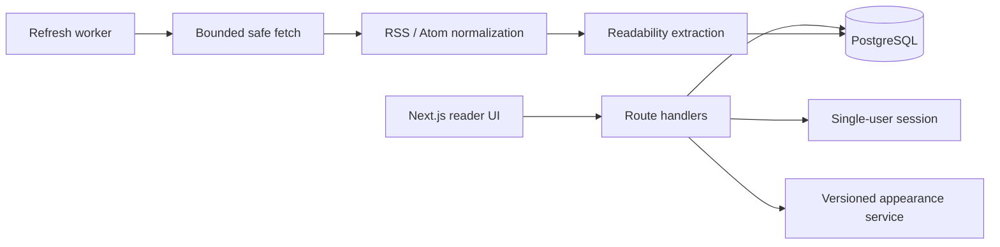

# Architecture

## Runtime boundaries

- **Web** renders the reader, validates browser requests, and exposes typed route handlers.
- **Worker** refreshes subscriptions independently from page requests and records recoverable feed errors.
- **Database** stores users, feeds, normalized articles, categories, reading state, and appearance configuration.
- **Safe fetch** validates each target and redirect, blocks private address ranges, constrains response size, and limits accepted content types.
- **Appearance service** validates versioned theme files before preview, import, export, or recovery.

The GitHub Pages demo is a separate static React entry point. It exercises the main reading interactions against embedded fixtures and never contacts the production API.