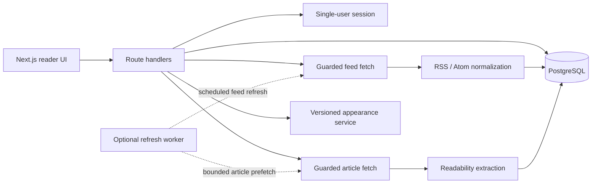

# Architecture

## Runtime boundaries

- **Web** renders the reader, validates browser requests, and exposes typed route handlers.
- **Worker** refreshes subscriptions independently from page requests and records recoverable feed errors. It is included in the normal Compose profile and intentionally omitted from the hosted-demo profile.
- **Database** stores users, feeds, normalized articles, categories, reading state, and appearance configuration.
- **Safe fetch** validates each target and redirect, blocks private address ranges, constrains response size, and limits accepted content types.
- **Appearance service** validates versioned theme files before preview, import, export, or recovery.

## Deployment profiles

| Profile | Components | Boundary |
| --- | --- | --- |
| Normal self-hosted | Web, worker, migration job, PostgreSQL | Scheduled background refresh is enabled; the operator supplies private configuration and HTTPS exposure. |
| Hosted demo | Web, migration job, deterministic seed job, isolated PostgreSQL | No worker; manual feed operations remain guarded and are additionally constrained by demo quotas and cooldowns. |

Both profiles bind the web process to a loopback host port by default. Public HTTPS exposure, DNS, proxy or tunnel configuration, monitoring, and scheduled reset jobs are deployment concerns rather than application services defined by these diagrams.
